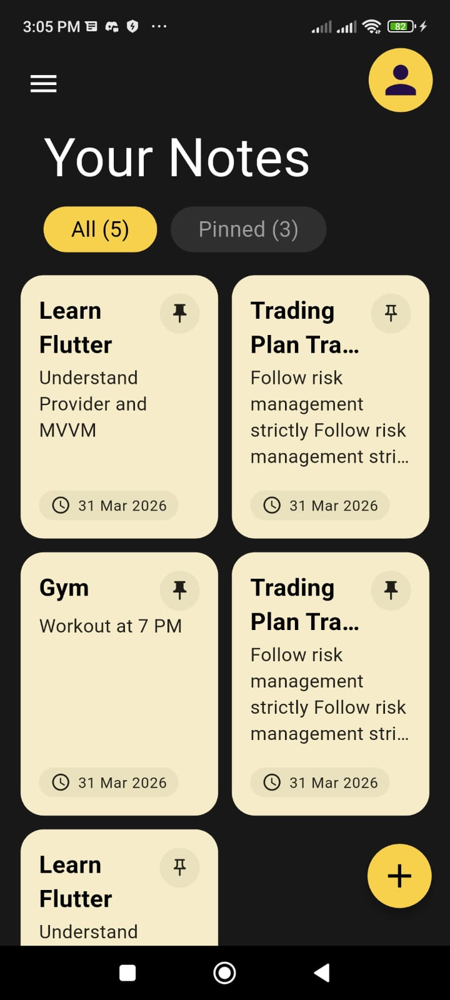
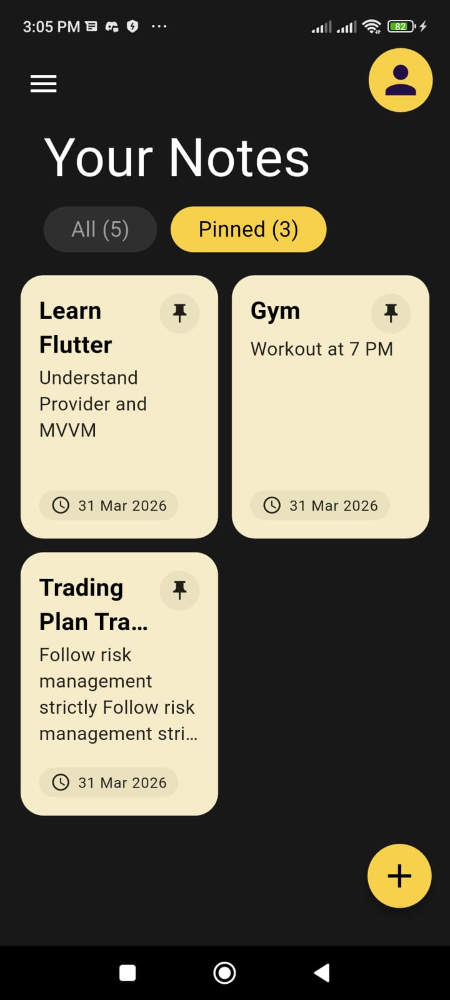
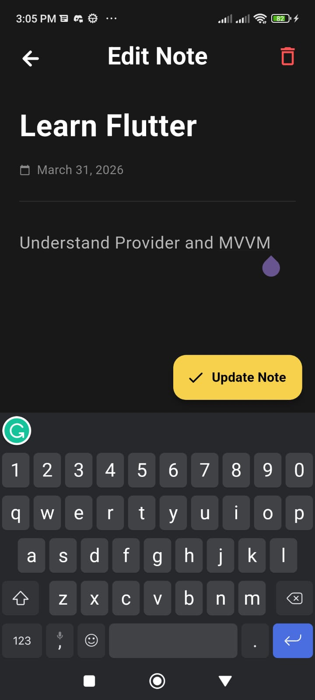
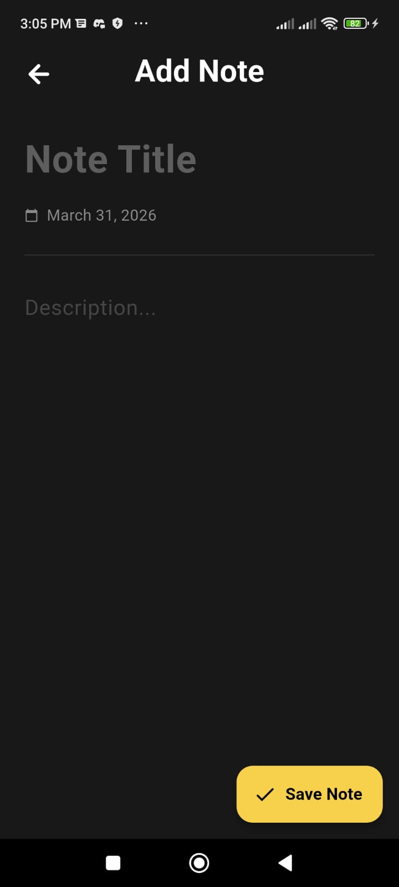
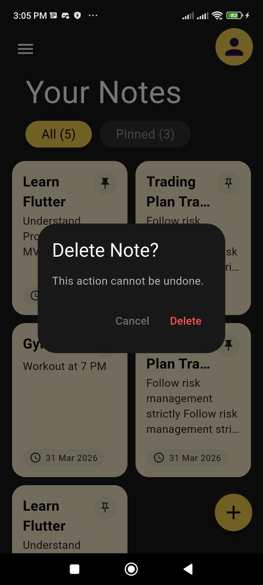

# 📝 Flutter Notes App

A modern Notes application built using Flutter with MVVM architecture.

## 🚀 Features
- Add Notes
- Edit Notes
- Delete Notes
- Search Notes 🔍
- Filter (All / Pinned 📌)
- Local Storage using Sqflite

## 🧠 Tech Stack
- Flutter
- Provider (State Management)
- Sqflite (Database)
- MVVM Architecture

## 📂 Folder Structure
lib/
- core/
- models/
- viewmodels/
- views/
- services/

## 📸 Screenshots

## 💡 Key Learnings
- State management with Provider
- Local database handling
- MVVM architecture implementation
- Filtering & search logic
